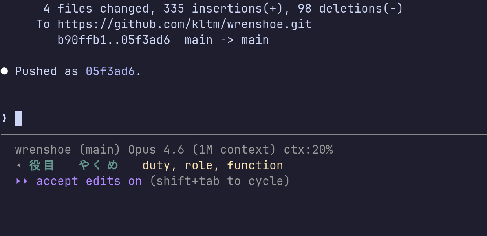

# Wrenshoe

Ambient, passive flashcard system for language learning. Cards cycle automatically in your peripheral vision — no interaction required.

## Purpose

Wrenshoe is designed for background, low-effort language study. Instead of quizzing you actively like most flashcard apps, it puts cards in your peripheral vision and lets your brain absorb them over time. The idea is that exposure is enough, if the exposure is persistent, patient, and low-friction.

Two frontends share a common deck format:

- **Web app** ([wrenshoe.org](https://wrenshoe.org)) — ambient and flashcard modes, PWA-installable on iOS / Android for full-screen nightstand use.
- **Claude Code status line** — cards cycle in the terminal status bar while you work.

Both frontends pull from the same deck JSONs and data model, so decks you add appear in both places.

## Claude Code status bar



The terminal cycler at `terminal/wrenshoe.py` renders one card face at a time as a single status-line string, slotted in beneath the normal Claude Code status info. Front fields render in bold cyan, back fields in yellow — the separation is color-based because many of the languages in Wrenshoe's decks use characters that resemble Latin punctuation. It's driven by Claude Code's `refreshInterval` and reads from `~/.config/wrenshoe/session.json`.

### Quick install (automated)

Use the `/wrenshoe install` skill to do everything below automatically.

### Manual install

1. Clone the repo somewhere stable (e.g. `~/local/src/git/wrenshoe`).
2. Configure a session:
   ```
   python3 terminal/wrenshoe.py --configure
   ```
3. Invoke `wrenshoe.py --render` from your status line script (see `terminal/wrenshoe.py` for the expected output contract).
4. Set `refreshInterval` in your Claude Code `settings.json`:
   ```json
   "statusLine": {
     "type": "command",
     "command": "bash ~/.claude/statusline-command.sh",
     "refreshInterval": 5
   }
   ```

The cycler respects per-deck timing, cycle modes (`front_back` / `front_back_both`), tag filters, and field assignment.

## Web app

### Using wrenshoe.org

Visit [wrenshoe.org](https://wrenshoe.org), pick a deck, and choose **Ambient** (passive cycling) or **Flashcard** (space = know, other key = don't know, score at end) mode.

On the mode screen you can:

- **Reassign fields** to front, back, or hidden on a per-deck basis.
- **Pick an ambient speed**: Fast (5s), Normal (15s), Slow (30s, default), or Very Slow (60s).

### Nightstand / StandBy-style use on iPhone

iOS doesn't let Safari go true full-screen for regular browsing, and Apple's real StandBy mode is reserved for native WidgetKit widgets. But the installed PWA gets close:

1. In Safari, open [wrenshoe.org](https://wrenshoe.org).
2. Tap **Share** > **Add to Home Screen** > **Add**.
3. Launch Wrenshoe from the new home-screen icon — iOS opens it in **standalone mode**, with no URL bar or toolbar. The status bar blends into the black background.
4. Pick a deck, enter **Ambient** mode, and rotate to landscape — the layout grows to fill the screen.
5. Dock the phone on a charger. The app requests a **wake lock** so the screen stays on while Wrenshoe is in the foreground.

Not technically "StandBy mode" (Apple reserves that name), but functionally the same experience without the Apple Developer commitment.

### Running your own instance

Clone the repo, generate the deck manifest, and serve locally:

```bash
git clone https://github.com/kltm/wrenshoe.git
cd wrenshoe
python3 tools/build-manifest.py    # generates docs/deck-manifest.json
ln -s ../data docs/data             # make deck data available to the app
cd docs && python3 -m http.server   # open http://localhost:8000
```

Add your own decks to `data/` (or `~/.local/share/wrenshoe/decks/`), re-run `build-manifest.py`, and refresh.

### Deploying to GitHub Pages

If you fork this repo and want your own hosted instance:

1. Go to your fork's **Settings > Pages**.
2. Under **Build and deployment > Source**, select **GitHub Actions**.
3. Push to `main` — the included workflow (`.github/workflows/pages.yml`) will build the site and deploy it automatically.
4. (Optional) Under **Settings > Pages > Custom domain**, add your domain and configure DNS per [GitHub's docs](https://docs.github.com/en/pages/configuring-a-custom-domain-for-github-pages).

The workflow runs `tools/build-manifest.py` to generate the deck index, then combines `docs/` (the app) and `data/` (the decks) into the deployed site. The reference deployment is at [wrenshoe.org](https://wrenshoe.org).

## Data model

### Overview

Deck schemas are defined in [LinkML](https://linkml.io/) (`schema/wrenshoe.yaml`), grounded in [OntoLex-Lemon](https://www.w3.org/2016/05/ontolex/) for lexical entries/forms/senses and [SKOS](https://www.w3.org/TR/skos-reference/) for labels and definitions. Language tags follow [BCP 47](https://www.rfc-editor.org/info/bcp47), including private-use subtags for dialects (e.g. `ja-x-kansai`).

Each deck defines **field definitions** (with language, semantic type `representation`/`sense`/`reference`, and display defaults) and **cards** (with field values and optional tags/weights). Decks also carry a top-level `license` (SPDX identifier) and `sources` (attribution for upstream data).

A JSON Schema compiled from the LinkML source lives at `schema/wrenshoe.schema.json` for tooling that doesn't speak LinkML directly.

### Included decks

**Japanese**

| Deck | Cards | License (SPDX) |
|------|-------|----------------|
| JLPT N5 | 710 | `CC-BY-SA-4.0 AND CC-BY-4.0` |
| JLPT N4 | 663 | `CC-BY-SA-4.0 AND CC-BY-4.0` |
| JLPT N3 | 2,078 | `CC-BY-SA-4.0 AND CC-BY-4.0` |
| JLPT N2 | 1,790 | `CC-BY-SA-4.0 AND CC-BY-4.0` |
| JLPT N1 | 2,655 | `CC-BY-SA-4.0 AND CC-BY-4.0` |
| Grade 1 Kanji (Kanken 10) | 80 | `CC-BY-SA-4.0` |
| Grade 2 Kanji (Kanken 9) | 160 | `CC-BY-SA-4.0` |
| Grade 3 Kanji (Kanken 8) | 200 | `CC-BY-SA-4.0` |
| Grade 4 Kanji (Kanken 7) | 202 | `CC-BY-SA-4.0` |
| Grade 5 Kanji (Kanken 6) | 193 | `CC-BY-SA-4.0` |
| Grade 6 Kanji (Kanken 5) | 191 | `CC-BY-SA-4.0` |
| Jouyou Secondary School | 1,110 | `CC-BY-SA-4.0` |
| Kansaiben vocabulary | 279 | `CC-BY-SA-3.0` |
| Hiragana | 73 | `CC-BY-4.0` |
| Katakana | 76 | `CC-BY-4.0` |

**Chinese**

| Deck | Cards | License (SPDX) |
|------|-------|----------------|
| HSK 1 | 150 | `CC-BY-SA-4.0` |
| HSK 2 | 150 | `CC-BY-SA-4.0` |
| HSK 3 | 299 | `CC-BY-SA-4.0` |
| HSK 4 | 601 | `CC-BY-SA-4.0` |
| HSK 5 | 1,298 | `CC-BY-SA-4.0` |
| HSK 6 | 2,500 | `CC-BY-SA-4.0` |
| Chit-Chat Chinese | 391 | `CC-BY-4.0` |
| Boya Chinese Elementary Starter II | 718 | `CC-BY-4.0` |
| Short-term Spoken Chinese: Threshold | 1,136 | `CC-BY-4.0` |
| Pinyin Reference | 61 | `CC-BY-4.0` |

**Korean**

| Deck | Cards | License (SPDX) |
|------|-------|----------------|
| Hangul Reading Practice | 157 | `CC-BY-4.0` |
| Korean Jamo | 67 | `CC-BY-4.0` |

**Other**

| Deck | Cards | License (SPDX) |
|------|-------|----------------|
| Morse Code | 36 | `CC-BY-4.0` |

### Adding your own decks

Starter decks live in `data/` and are shipped with the repo. **User decks** belong in `~/.local/share/wrenshoe/decks/` — the terminal cycler picks them up automatically, and for the web app you can drop them alongside the starter decks in your fork.

Workflow:

1. Write a JSON file following the schema at `schema/wrenshoe.yaml`. The quickest way is to copy an existing deck (e.g. `data/hiragana.json`) and edit it.
2. Every deck **must** have `id`, `name`, `source_language`, `field_definitions`, `license`, and `sources`.
3. Validate before saving — this is non-negotiable:
   ```
   linkml-validate -s schema/wrenshoe.yaml path/to/your_deck.json
   ```
4. For the web app, re-run `python3 tools/build-manifest.py` to regenerate the deck index.
5. For the Claude Code skill, the `/wrenshoe add-deck`, `/wrenshoe add-cards`, and `/wrenshoe import` subcommands automate this flow conversationally.

### Tools

- `tools/build-manifest.py` — generates `docs/deck-manifest.json` from `data/*.json` for the web app.
- `tools/convert-legacy.py` — converts legacy Wrenshoe `.meta`/`.data` deck pairs to the new JSON format.
- `tools/build-jlpt-decks.py` — builds JLPT and kanji decks from JMdict/KANJIDIC2.
- `tools/build-hsk-decks.py` — builds HSK decks from complete-hsk-vocabulary.
- `tools/build-korean-decks.py` — builds Korean hangul deck (historical; current deck is hand-curated).

## For AI assistants

This repo includes a [`CLAUDE.md`](CLAUDE.md) with operational guidance for Claude Code and other AI coding assistants: deck management rules, license-compatibility notes between data sources, rendering constraints (e.g. why no em-dashes between CJK fields), and the conventions used across the code base. Read it before editing decks or extending the schema programmatically.

## Licenses & attribution

**Code and data are licensed separately.** Code and data files should never be assumed to share a license.

### Code

BSD-3-Clause (SPDX: `BSD-3-Clause`). Applies to `terminal/`, `tools/`, `schema/`, and `docs/` (the web app). See [LICENSE](LICENSE).

### Data

Each deck JSON carries its own `license` (SPDX identifier) and `sources` (upstream attribution) fields. The full per-deck breakdown is in [`data/ATTRIBUTION.md`](data/ATTRIBUTION.md).

**Most derived decks are `CC-BY-SA-4.0`; original Wrenshoe decks are `CC-BY-4.0`.** The Kansai-ben deck is `CC-BY-SA-3.0`. JLPT decks are compound-licensed (`CC-BY-SA-4.0 AND CC-BY-4.0`).

### Data source creators

Wrenshoe's decks are built on generous open-licensed work by many people and projects. If you use these decks in your own work, cite the upstream sources, not just Wrenshoe.

**Japanese:**

- **JMdict & KANJIDIC2** — Jim Breen / [EDRDG](https://www.edrdg.org/) at Monash University
- **JMdict JSON conversion** — [scriptin/jmdict-simplified](https://github.com/scriptin/jmdict-simplified)
- **JLPT word lists** — Jonathan Waller ([tanos.co.uk](https://www.tanos.co.uk/jlpt/)), compiled by [jamsinclair/open-anki-jlpt-decks](https://github.com/jamsinclair/open-anki-jlpt-decks)
- **Kansai-ben vocabulary** — Keiko Yukawa ([kansaibenkyou.net](http://kansaibenkyou.net))

**Chinese:**

- **[CC-CEDICT](https://cc-cedict.org)** — the CC-CEDICT project contributors
- **HSK vocabulary** — [drkameleon/complete-hsk-vocabulary](https://github.com/drkameleon/complete-hsk-vocabulary) (derived from CC-CEDICT)
- **Chit-Chat Chinese** — Rachel Meyer et al. (Far East Book Co., 2010)
- **Boya Chinese Elementary Starter II** — Li Xiaoqi et al. (Peking University Press)
- **Short-term Spoken Chinese: Threshold** — Ma Jianfei et al. (Beijing Language and Culture University Press)

**Original Wrenshoe decks:**

- **Hiragana, Katakana, Pinyin Reference, Korean Jamo, Korean Hangul Reading Practice, Morse Code**, and the **Chinese textbook hand-entries** (Chit-Chat, Boya, Short-term Spoken Chinese) — Seth Carbon

### License-compatibility notes

Not every open license is automatically compatible with every other. When adding new decks or combining data:

- **`CC-BY-SA-3.0` and `CC-BY-SA-4.0` are NOT automatically compatible.** Content under one cannot simply be merged into a deck under the other without a compatibility audit.
- **`CC-BY` is compatible with `CC-BY-SA`** — it can be incorporated into SA-licensed works.
- **`MIT`** data is compatible with everything.
- Use SPDX compound expressions (`AND`) when a deck derives from multiple sources with different licenses.

### How to cite

If you use Wrenshoe decks in your work, cite the upstream data sources listed in each deck's `sources` field first. For the project itself:

> Wrenshoe: Ambient passive flashcard system. https://github.com/kltm/wrenshoe
